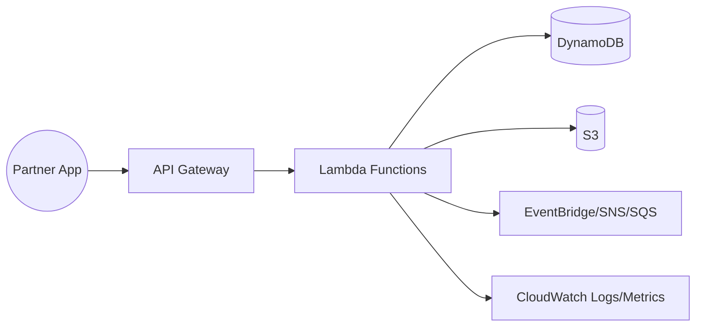

# Day 1 — Welcome & Architecture Overview

> *Tutor voice:* In this lesson, I'll guide you step-by-step. Keep your AWS region set to **us-east-2 (Ohio)**. Use **nano** to edit files as we go.

## ✨ Concept (Textbook Style)

Welcome to **SkyBridge API Lab**. We will build an airline-grade, third‑party API platform using **API Gateway + Lambda + DynamoDB + S3**, secured by **IAM**, instrumented by **CloudWatch**, and governed by **Budgets/Config**.

Today you’ll set up your workstation, validate your AWS CLI, and review the system blueprint.


<!-- ALERT: new-concept -->

### ✈️ Analogy
Think of our platform like an **airport**: API Gateway is the **check‑in desk**, Lambda is the **ground crew**, DynamoDB is the **baggage warehouse**, CloudWatch is the **control tower**.

## 🗺️ Architecture (Mermaid)


## 🧪 Hands-On Lab (Step by Step)

1) Verify AWS CLI and region:
```bash
aws sts get-caller-identity
aws configure get region
```
Expect `us-east-2`. If not:
```bash
aws configure set region us-east-2
```

2) Create a project S3 bucket for artifacts (unique name required):
```bash
export LAB_BUCKET=skybridge-artifacts-$RANDOM
aws s3 mb s3://$LAB_BUCKET --region us-east-2
echo $LAB_BUCKET > labs/.bucket_name
```

3) Create a tags file for consistent tagging:
```bash
cat > labs/tags.json <<'EOF'
{ "Project": "SkyBridge", "Owner": "olumidetowoju", "Env": "lab", "CostCenter": "free-tier" }
EOF
```


## 🧹 Cleanup (Free Tier Safety)

- If you created the S3 bucket, you may keep it for the course. To remove later:
```bash
LAB_BUCKET=$(cat labs/.bucket_name)
aws s3 rb s3://$LAB_BUCKET --force
```


## ✅ Outcomes

- AWS CLI ready in **us-east-2**
- Artifact bucket created and tagged
- Architecture and roles understood


---
**Notes**: Use `nano` to open and edit files. Save with **Ctrl+O**, **Enter**, exit with **Ctrl+X**.
