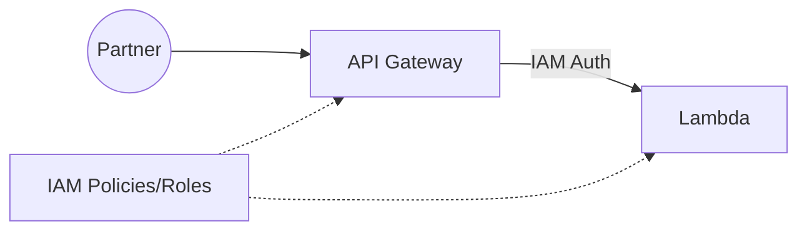

# Day 2 — API Gateway Foundations & IAM Security

> *Tutor voice:* In this lesson, I'll guide you step-by-step. Keep your AWS region set to **us-east-2 (Ohio)**. Use **nano** to edit files as we go.

## ✨ Concept (Textbook Style)
We secure our APIs using IAM roles & policies while setting up an initial API Gateway endpoint.

<!-- ALERT: new-concept -->

### ✈️ Analogy
**Check‑in desk** verifies passenger identity and tickets → API Gateway validates/authenticates and throttles.

## 🗺️ Architecture (Mermaid)


## 🧪 Hands-On Lab (Step by Step)

1) Create an execution role for Lambda:
```bash
cat > labs/lambda-trust.json <<'EOF'
{ "Version":"2012-10-17","Statement":[{"Effect":"Allow","Principal":{"Service":"lambda.amazonaws.com"},"Action":"sts:AssumeRole"}] }
EOF

aws iam create-role --role-name skybridge-lambda-exec --assume-role-policy-document file://labs/lambda-trust.json

aws iam attach-role-policy --role-name skybridge-lambda-exec       --policy-arn arn:aws:iam::aws:policy/service-role/AWSLambdaBasicExecutionRole
```

2) Create a simple Lambda function (Python):
```bash
mkdir -p labs/day02 && cd labs/day02
cat > handler.py <<'PY'
import json
def lambda_handler(event, context):
    return {"statusCode": 200, "body": json.dumps({"message": "Hello from SkyBridge"})}
PY
zip function.zip handler.py
ROLE_ARN=$(aws iam get-role --role-name skybridge-lambda-exec --query 'Role.Arn' -o text)
aws lambda create-function --function-name skybridge-hello       --runtime python3.11 --zip-file fileb://function.zip       --handler handler.lambda_handler --role $ROLE_ARN
cd -
```

3) Create an HTTP API in API Gateway and integrate with Lambda:
```bash
LAMBDA_ARN=$(aws lambda get-function --function-name skybridge-hello --query 'Configuration.FunctionArn' -o text)

API_ID=$(aws apigatewayv2 create-api --name skybridge-http --protocol-type HTTP       --target $LAMBDA_ARN --query 'ApiId' -o text)

# Add a $default stage
aws apigatewayv2 create-stage --api-id $API_ID --stage-name '$default' --auto-deploy
echo $API_ID > labs/.api_id
```

4) Test the endpoint:
```bash
API_ID=$(cat labs/.api_id)
URL="https://$API_ID.execute-api.us-east-2.amazonaws.com"
curl -s $URL | jq
```


## 🧹 Cleanup (Free Tier Safety)

```bash
API_ID=$(cat labs/.api_id)
aws apigatewayv2 delete-api --api-id $API_ID
aws lambda delete-function --function-name skybridge-hello
aws iam detach-role-policy --role-name skybridge-lambda-exec --policy-arn arn:aws:iam::aws:policy/service-role/AWSLambdaBasicExecutionRole
aws iam delete-role --role-name skybridge-lambda-exec
```


## ✅ Outcomes
- API Gateway + Lambda baseline working
- IAM execution role created
- Endpoint tested

---
**Notes**: Use `nano` to open and edit files. Save with **Ctrl+O**, **Enter**, exit with **Ctrl+X**.
