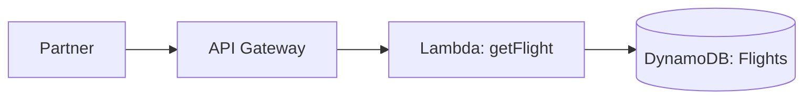

# Day 3 — Flight Status Query API

> *Tutor voice:* In this lesson, I'll guide you step-by-step. Keep your AWS region set to **us-east-2 (Ohio)**. Use **nano** to edit files as we go.

## ✨ Concept (Textbook Style)
Build a read-focused API that returns flight status from DynamoDB via Lambda.

<!-- ALERT: new-concept -->

### ✈️ Analogy
**Departure board** shows current status; our API is that board for partners.

## 🗺️ Architecture (Mermaid)


## 🧪 Hands-On Lab (Step by Step)

1) Create DynamoDB table:
```bash
aws dynamodb create-table --table-name skybridge-flights       --attribute-definitions AttributeName=flight_no,AttributeType=S       --key-schema AttributeName=flight_no,KeyType=HASH       --billing-mode PAY_PER_REQUEST
```

2) Seed sample data:
```bash
cat > labs/flights.json <<'EOF'
[
  {"flight_no":"SKY101","status":"ON_TIME","gate":"A3"},
  {"flight_no":"SKY202","status":"DELAYED","gate":"B1"}
]
EOF
python3 - <<'PY'
import json, subprocess
items=json.load(open('labs/flights.json'))
for it in items:
    subprocess.run(['aws','dynamodb','put-item','--table-name','skybridge-flights',
                    '--item',json.dumps({k:{'S':str(v)} for k,v in it.items()})])
PY
```

3) Lambda (Python) to query a flight:
```bash
mkdir -p labs/day03 && cd labs/day03
cat > handler.py <<'PY'
import os, json, boto3
ddb=boto3.client('dynamodb')
TABLE='skybridge-flights'
def lambda_handler(event, context):
    flight=event.get('queryStringParameters',{}).get('flight_no','')
    if not flight:
        return {'statusCode':400,'body':json.dumps({'error':'flight_no required'})}
    r=ddb.get_item(TableName=TABLE, Key={'flight_no':{'S':flight}})
    if 'Item' not in r:
        return {'statusCode':404,'body':json.dumps({'error':'not found'})}
    item={k:list(v.values())[0] for k,v in r['Item'].items()}
    return {'statusCode':200,'body':json.dumps(item)}
PY
zip function.zip handler.py
ROLE_ARN=$(aws iam get-role --role-name skybridge-lambda-exec --query 'Role.Arn' -o text)
aws lambda create-function --function-name skybridge-get-flight       --runtime python3.11 --zip-file fileb://function.zip       --handler handler.lambda_handler --role $ROLE_ARN
cd -
```

4) Grant Lambda read to DynamoDB:
```bash
ACCOUNT_ID=$(aws sts get-caller-identity --query Account --output text)
cat > labs/ddb-read-policy.json <<EOF
{{"Version":"2012-10-17","Statement":[{{"Effect":"Allow","Action":["dynamodb:GetItem"],"Resource":"arn:aws:dynamodb:us-east-2:${{ACCOUNT_ID}}:table/skybridge-flights"}}]}}
EOF
aws iam put-role-policy --role-name skybridge-lambda-exec --policy-name ddb-read --policy-document file://labs/ddb-read-policy.json
```

5) Create /flight endpoint:
```bash
API_ID=$(cat labs/.api_id)
LAMBDA_ARN=$(aws lambda get-function --function-name skybridge-get-flight --query 'Configuration.FunctionArn' -o text)
# Add a new route with Lambda integration
RT_ID=$(aws apigatewayv2 create-integration --api-id $API_ID --integration-type AWS_PROXY       --integration-uri $LAMBDA_ARN --payload-format-version 2.0 --query 'IntegrationId' -o text)
aws apigatewayv2 create-route --api-id $API_ID --route-key "GET /flight" --target integrations/$RT_ID
```

6) Test:
```bash
URL="https://$API_ID.execute-api.us-east-2.amazonaws.com/flight?flight_no=SKY101"
curl -s "$URL" | jq
```


## 🧹 Cleanup (Free Tier Safety)

- You can retain the table for later modules, or clean up:
```bash
aws lambda delete-function --function-name skybridge-get-flight
aws iam delete-role-policy --role-name skybridge-lambda-exec --policy-name ddb-read || true
aws dynamodb delete-table --table-name skybridge-flights
```


## ✅ Outcomes
- Query endpoint returns flight status
- DynamoDB table provisioned on demand billing
- API route `/flight` online

---
**Notes**: Use `nano` to open and edit files. Save with **Ctrl+O**, **Enter**, exit with **Ctrl+X**.
