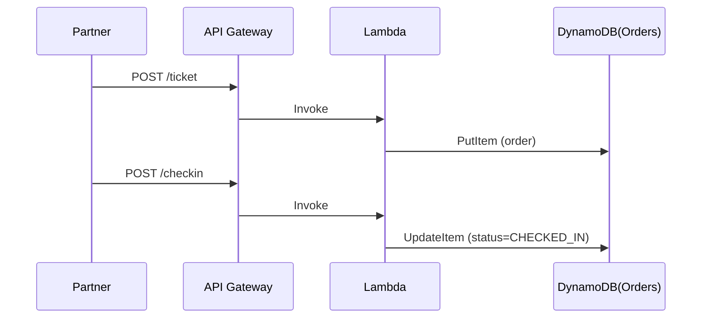

# Day 4 — Passenger Ticketing & Check-in API

> *Tutor voice:* In this lesson, I'll guide you step-by-step. Keep your AWS region set to **us-east-2 (Ohio)**. Use **nano** to edit files as we go.

## ✨ Concept (Textbook Style)
Implement a simple ONE Order–inspired ticketing & check‑in flow with serverless components.

<!-- ALERT: new-concept -->

### ✈️ Analogy
**Boarding pass** is a token of permission; our API issues and validates such tokens.

## 🗺️ Architecture (Mermaid)


## 🧪 Hands-On Lab (Step by Step)

1) Create an Orders table:
```bash
aws dynamodb create-table --table-name skybridge-orders       --attribute-definitions AttributeName=order_id,AttributeType=S       --key-schema AttributeName=order_id,KeyType=HASH       --billing-mode PAY_PER_REQUEST
```

2) Lambda handlers (issue ticket & check-in):
```bash
mkdir -p labs/day04 && cd labs/day04
cat > handler.py <<'PY'
import json, uuid, boto3
ddb=boto3.client('dynamodb')
T='skybridge-orders'
def issue(event, context):
    body=json.loads(event.get('body') or '{}')
    order_id=str(uuid.uuid4())
    item={'order_id':{'S':order_id},'pax':{'S':body.get('pax','UNKNOWN')},'status':{'S':'ISSUED'}}
    ddb.put_item(TableName=T, Item=item)
    return {'statusCode':201,'body':json.dumps({'order_id':order_id,'status':'ISSUED'})}
def checkin(event, context):
    body=json.loads(event.get('body') or '{}')
    oid=body.get('order_id')
    if not oid: return {'statusCode':400,'body':json.dumps({'error':'order_id required'})}
    ddb.update_item(TableName=T, Key={'order_id':{'S':oid}},
                    UpdateExpression='SET #s = :v', ExpressionAttributeNames={'#s':'status'},
                    ExpressionAttributeValues={':v':{'S':'CHECKED_IN'}})
    return {'statusCode':200,'body':json.dumps({'order_id':oid,'status':'CHECKED_IN'})}
PY
zip issue.zip handler.py
zip checkin.zip handler.py
ROLE_ARN=$(aws iam get-role --role-name skybridge-lambda-exec --query 'Role.Arn' -o text)
aws lambda create-function --function-name skybridge-issue-ticket       --runtime python3.11 --zip-file fileb://issue.zip --handler handler.issue --role $ROLE_ARN
aws lambda create-function --function-name skybridge-checkin       --runtime python3.11 --zip-file fileb://checkin.zip --handler handler.checkin --role $ROLE_ARN
cd -
```

3) Grant DDB write:
```bash
ACCOUNT_ID=$(aws sts get-caller-identity --query Account --output text)
cat > labs/ddb-write-policy.json <<EOF
{{"Version":"2012-10-17","Statement":[{{"Effect":"Allow","Action":["dynamodb:PutItem","dynamodb:UpdateItem"],"Resource":"arn:aws:dynamodb:us-east-2:${{ACCOUNT_ID}}:table/skybridge-orders"}}]}}
EOF
aws iam put-role-policy --role-name skybridge-lambda-exec --policy-name ddb-write --policy-document file://labs/ddb-write-policy.json
```

4) Routes:
```bash
API_ID=$(cat labs/.api_id)
for FN in skybridge-issue-ticket skybridge-checkin; do
  ARN=$(aws lambda get-function --function-name $FN --query 'Configuration.FunctionArn' -o text)
  INTEGRATION=$(aws apigatewayv2 create-integration --api-id $API_ID --integration-type AWS_PROXY         --integration-uri $ARN --payload-format-version 2.0 --query 'IntegrationId' -o text)
  if [ "$FN" = "skybridge-issue-ticket" ]; then
    aws apigatewayv2 create-route --api-id $API_ID --route-key "POST /ticket" --target integrations/$INTEGRATION
  else
    aws apigatewayv2 create-route --api-id $API_ID --route-key "POST /checkin" --target integrations/$INTEGRATION
  fi
done
```

5) Test:
```bash
URL="https://$API_ID.execute-api.us-east-2.amazonaws.com"
curl -s -X POST "$URL/ticket" -d '{"pax":"Ada Lovelace"}' | jq
# copy order_id and check-in
curl -s -X POST "$URL/checkin" -d '{"order_id":"<paste>"}' | jq
```


## 🧹 Cleanup (Free Tier Safety)

- Keep resources for later modules, or clean up:
```bash
aws lambda delete-function --function-name skybridge-issue-ticket
aws lambda delete-function --function-name skybridge-checkin
aws iam delete-role-policy --role-name skybridge-lambda-exec --policy-name ddb-write || true
aws dynamodb delete-table --table-name skybridge-orders
```


## ✅ Outcomes
- Ticket issued & check-in flow working
- ONE Order–inspired lifecycle in DynamoDB
- Two POST routes added

---
**Notes**: Use `nano` to open and edit files. Save with **Ctrl+O**, **Enter**, exit with **Ctrl+X**.
