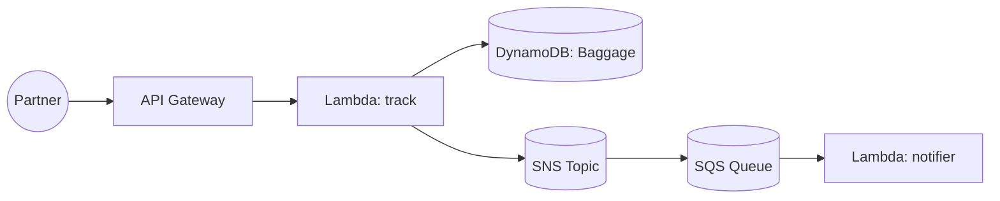

# Day 5 — Baggage Tracking API

> *Tutor voice:* In this lesson, I'll guide you step-by-step. Keep your AWS region set to **us-east-2 (Ohio)**. Use **nano** to edit files as we go.

## ✨ Concept (Textbook Style)
Track baggage lifecycle with an evented update pattern (SNS/SQS) and query via API.

<!-- ALERT: new-concept -->

### ✈️ Analogy
A **baggage tag** is like a **parcel tracking ID**; events update its journey.

## 🗺️ Architecture (Mermaid)


## 🧪 Hands-On Lab (Step by Step)

1) Create table and SNS topic:
```bash
aws dynamodb create-table --table-name skybridge-baggage       --attribute-definitions AttributeName=bag_tag,AttributeType=S       --key-schema AttributeName=bag_tag,KeyType=HASH       --billing-mode PAY_PER_REQUEST

aws sns create-topic --name skybridge-baggage-events
TOPIC_ARN=$(aws sns list-topics --query 'Topics[?contains(TopicArn, `skybridge-baggage-events`)].TopicArn' -o text)
```

2) Lambda for updating baggage and publishing event:
```bash
mkdir -p labs/day05 && cd labs/day05
cat > handler.py <<'PY'
import json, boto3
ddb=boto3.client('dynamodb'); sns=boto3.client('sns')
T='skybridge-baggage'
TOPIC_ARN=None
def _topic():
    global TOPIC_ARN
    if not TOPIC_ARN:
        TOPIC_ARN=[t['TopicArn'] for t in sns.list_topics()['Topics'] if 'skybridge-baggage-events' in t['TopicArn']][0]
    return TOPIC_ARN
def track(event, ctx):
    body=json.loads(event.get('body') or '{}')
    tag=body.get('bag_tag'); status=body.get('status','CREATED')
    if not tag: return {'statusCode':400,'body':json.dumps({'error':'bag_tag required'})}
    ddb.put_item(TableName=T, Item={'bag_tag':{'S':tag},'status':{'S':status}})
    sns.publish(TopicArn=_topic(), Message=json.dumps({'bag_tag':tag,'status':status}))
    return {'statusCode':200,'body':json.dumps({'bag_tag':tag,'status':status})}
PY
zip fn.zip handler.py
ROLE_ARN=$(aws iam get-role --role-name skybridge-lambda-exec --query 'Role.Arn' -o text)
aws lambda create-function --function-name skybridge-baggage-track       --runtime python3.11 --zip-file fileb://fn.zip --handler handler.track --role $ROLE_ARN
cd -
```

3) Permissions:
```bash
ACCOUNT_ID=$(aws sts get-caller-identity --query Account --output text)
cat > labs/day05-policy.json <<EOF
{{"Version":"2012-10-17","Statement":[
  {{"Effect":"Allow","Action":["dynamodb:PutItem"],"Resource":"arn:aws:dynamodb:us-east-2:${{ACCOUNT_ID}}:table/skybridge-baggage"}},
  {{"Effect":"Allow","Action":["sns:Publish","sns:ListTopics"],"Resource":"*"}}
]}}
EOF
aws iam put-role-policy --role-name skybridge-lambda-exec --policy-name baggage-write-sns --policy-document file://labs/day05-policy.json
```

4) Route:
```bash
API_ID=$(cat labs/.api_id)
LAMBDA_ARN=$(aws lambda get-function --function-name skybridge-baggage-track --query 'Configuration.FunctionArn' -o text)
INTEG=$(aws apigatewayv2 create-integration --api-id $API_ID --integration-type AWS_PROXY --integration-uri $LAMBDA_ARN --payload-format-version 2.0 --query 'IntegrationId' -o text)
aws apigatewayv2 create-route --api-id $API_ID --route-key "POST /baggage" --target integrations/$INTEG
```

5) Test:
```bash
URL="https://$API_ID.execute-api.us-east-2.amazonaws.com"
curl -s -X POST "$URL/baggage" -d '{"bag_tag":"BG123","status":"LOADED"}' | jq
```


## 🧹 Cleanup (Free Tier Safety)

```bash
aws lambda delete-function --function-name skybridge-baggage-track
aws iam delete-role-policy --role-name skybridge-lambda-exec --policy-name baggage-write-sns || true
aws sns delete-topic --topic-arn "$TOPIC_ARN" || true
aws dynamodb delete-table --table-name skybridge-baggage
```


## ✅ Outcomes
- Evented baggage updates stored and published
- API route `/baggage` online
- SNS topic emits partner notifications

---
**Notes**: Use `nano` to open and edit files. Save with **Ctrl+O**, **Enter**, exit with **Ctrl+X**.
