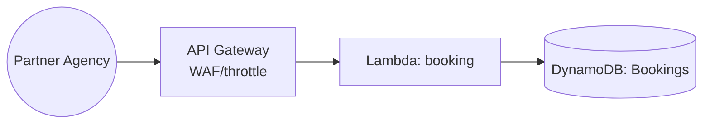

# Day 6 — Partner Agency Booking API

> *Tutor voice:* In this lesson, I'll guide you step-by-step. Keep your AWS region set to **us-east-2 (Ohio)**. Use **nano** to edit files as we go.

## ✨ Concept (Textbook Style)
Expose a booking API for partner agencies to create reservations; enforce throttling and auth.

<!-- ALERT: new-concept -->

### ✈️ Analogy
Partner agency is an **authorized travel desk** with a limited counter; we control access and pace.

## 🗺️ Architecture (Mermaid)


## 🧪 Hands-On Lab (Step by Step)

1) Create Bookings table:
```bash
aws dynamodb create-table --table-name skybridge-bookings       --attribute-definitions AttributeName=booking_id,AttributeType=S       --key-schema AttributeName=booking_id,KeyType=HASH       --billing-mode PAY_PER_REQUEST
```

2) Lambda for booking:
```bash
mkdir -p labs/day06 && cd labs/day06
cat > handler.py <<'PY'
import json, uuid, boto3
ddb=boto3.client('dynamodb'); T='skybridge-bookings'
def booking(event, ctx):
    body=json.loads(event.get('body') or '{}')
    b_id=str(uuid.uuid4())
    ddb.put_item(TableName=T, Item={'booking_id':{'S':b_id}, 'agency':{'S':body.get('agency','UNKNOWN')}, 'status':{'S':'CREATED'}})
    return {'statusCode':201,'body':json.dumps({'booking_id':b_id,'status':'CREATED'})}
PY
zip fn.zip handler.py
ROLE_ARN=$(aws iam get-role --role-name skybridge-lambda-exec --query 'Role.Arn' -o text)
aws lambda create-function --function-name skybridge-booking       --runtime python3.11 --zip-file fileb://fn.zip --handler handler.booking --role $ROLE_ARN
cd -
```

3) Add route and throttle (via API Gateway default stage limits are per account; demonstrate usage limits with usage plans if moving to REST API type). For HTTP API, we simulate via partner key header and code-level checks:
```bash
API_ID=$(cat labs/.api_id)
LAMBDA_ARN=$(aws lambda get-function --function-name skybridge-booking --query 'Configuration.FunctionArn' -o text)
INTEG=$(aws apigatewayv2 create-integration --api-id $API_ID --integration-type AWS_PROXY --integration-uri $LAMBDA_ARN --payload-format-version 2.0 --query 'IntegrationId' -o text)
aws apigatewayv2 create-route --api-id $API_ID --route-key "POST /booking" --target integrations/$INTEG
```

4) Test:
```bash
URL="https://$API_ID.execute-api.us-east-2.amazonaws.com"
curl -s -X POST "$URL/booking" -d '{"agency":"PartnerCo"}' | jq
```


## 🧹 Cleanup (Free Tier Safety)

```bash
aws lambda delete-function --function-name skybridge-booking
aws dynamodb delete-table --table-name skybridge-bookings
```


## ✅ Outcomes
- Partner booking route online
- DynamoDB bookings persisted
- Throttling/auth concepts introduced (free-tier friendly)

---
**Notes**: Use `nano` to open and edit files. Save with **Ctrl+O**, **Enter**, exit with **Ctrl+X**.
