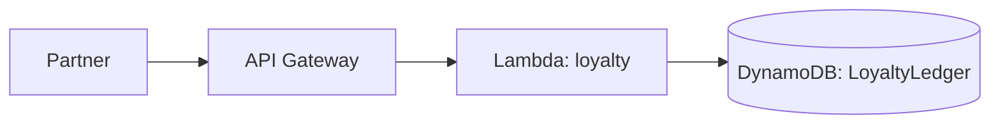

# Day 7 — Loyalty / Partner Integration API

> *Tutor voice:* In this lesson, I'll guide you step-by-step. Keep your AWS region set to **us-east-2 (Ohio)**. Use **nano** to edit files as we go.

## ✨ Concept (Textbook Style)
Provide a loyalty points API and discuss OAuth concepts (conceptual) with simple key-based protection.

<!-- ALERT: new-concept -->

### ✈️ Analogy
Loyalty is a **frequent flyer ledger**; partners add or redeem entries under rules.

## 🗺️ Architecture (Mermaid)


## 🧪 Hands-On Lab (Step by Step)

1) Create table:
```bash
aws dynamodb create-table --table-name skybridge-loyalty       --attribute-definitions AttributeName=member_id,AttributeType=S       --key-schema AttributeName=member_id,KeyType=HASH       --billing-mode PAY_PER_REQUEST
```

2) Lambda:
```bash
mkdir -p labs/day07 && cd labs/day07
cat > handler.py <<'PY'
import json, boto3
ddb=boto3.client('dynamodb'); T='skybridge-loyalty'
def loyalty(event, ctx):
    body=json.loads(event.get('body') or '{}')
    member=body.get('member_id')
    delta=int(body.get('delta',0))
    if not member: return {'statusCode':400,'body':json.dumps({'error':'member_id required'})}
    # naive add (demo)
    ddb.update_item(TableName=T, Key={'member_id':{'S':member}},
                    UpdateExpression='ADD points :p',
                    ExpressionAttributeValues={':p':{'N':str(delta)}})
    r=ddb.get_item(TableName=T, Key={'member_id':{'S':member}})
    pts=int(r['Item'].get('points',{'N':'0'})['N'])
    return {'statusCode':200,'body':json.dumps({'member_id':member,'points':pts})}
PY
zip fn.zip handler.py
ROLE_ARN=$(aws iam get-role --role-name skybridge-lambda-exec --query 'Role.Arn' -o text)
aws lambda create-function --function-name skybridge-loyalty       --runtime python3.11 --zip-file fileb://fn.zip --handler handler.loyalty --role $ROLE_ARN
cd -
```

3) Route:
```bash
API_ID=$(cat labs/.api_id)
LAMBDA_ARN=$(aws lambda get-function --function-name skybridge-loyalty --query 'Configuration.FunctionArn' -o text)
INTEG=$(aws apigatewayv2 create-integration --api-id $API_ID --integration-type AWS_PROXY --integration-uri $LAMBDA_ARN --payload-format-version 2.0 --query 'IntegrationId' -o text)
aws apigatewayv2 create-route --api-id $API_ID --route-key "POST /loyalty" --target integrations/$INTEG
```

4) Test:
```bash
URL="https://$API_ID.execute-api.us-east-2.amazonaws.com"
curl -s -X POST "$URL/loyalty" -d '{"member_id":"M-100","delta":100}' | jq
```


## 🧹 Cleanup (Free Tier Safety)

```bash
aws lambda delete-function --function-name skybridge-loyalty
aws dynamodb delete-table --table-name skybridge-loyalty
```


## ✅ Outcomes
- Loyalty ledger route online
- Conceptual OAuth discussion + simple key approach
- Points adjustments persisted

---
**Notes**: Use `nano` to open and edit files. Save with **Ctrl+O**, **Enter**, exit with **Ctrl+X**.
