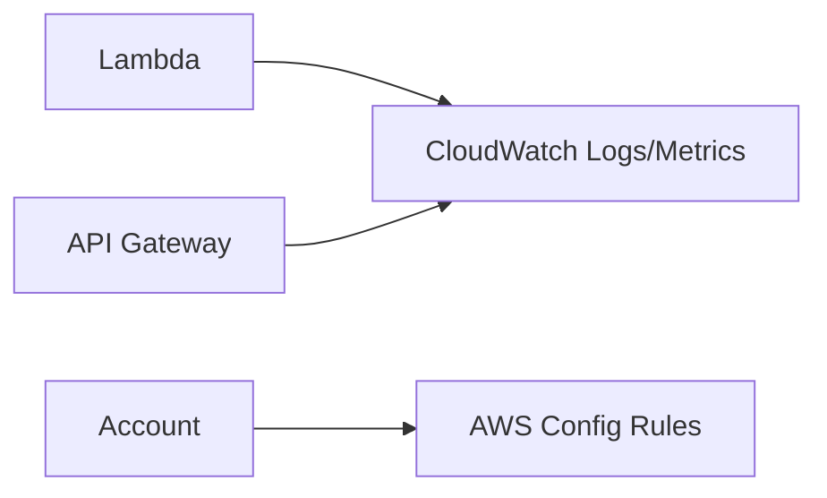

# Day 8 — Monitoring, Logging & Compliance

> *Tutor voice:* In this lesson, I'll guide you step-by-step. Keep your AWS region set to **us-east-2 (Ohio)**. Use **nano** to edit files as we go.

## ✨ Concept (Textbook Style)
Instrument APIs with CloudWatch metrics/logs; introduce AWS Config for compliance baselines.

<!-- ALERT: new-concept -->

### ✈️ Analogy
**Control tower** watches all flights; logs & rules keep airspace safe.

## 🗺️ Architecture (Mermaid)


## 🧪 Hands-On Lab (Step by Step)

1) CloudWatch metrics & logs are enabled by default on Lambda/API Gateway. Query recent logs:
```bash
aws logs describe-log-groups --log-group-name-prefix /aws/lambda/ --max-items 5
```

2) Create a simple metric alarm for Lambda errors (SMS/email via SNS is optional):
```bash
FN=skybridge-get-flight
aws cloudwatch put-metric-alarm --alarm-name SkyBridge-Lambda-Errors --metric-name Errors       --namespace AWS/Lambda --statistic Sum --period 60 --threshold 1 --comparison-operator GreaterThanOrEqualToThreshold       --dimensions Name=FunctionName,Value=$FN --evaluation-periods 1
```

3) Enable AWS Config (note: may create S3 bucket & role; keep defaults to stay in free-tier-level usage):
```bash
# In console or via CLI; simplest via console for first-time setup.
echo "Open AWS Console > Config > Set up recorder and delivery channel"
```


## 🧹 Cleanup (Free Tier Safety)

```bash
aws cloudwatch delete-alarms --alarm-names SkyBridge-Lambda-Errors
# AWS Config can be left enabled; disable if you wish to minimize resource usage.
```


## ✅ Outcomes
- You can view logs & create alarms
- Understand AWS Config purpose and setup steps
- Compliance lens applied

---
**Notes**: Use `nano` to open and edit files. Save with **Ctrl+O**, **Enter**, exit with **Ctrl+X**.
