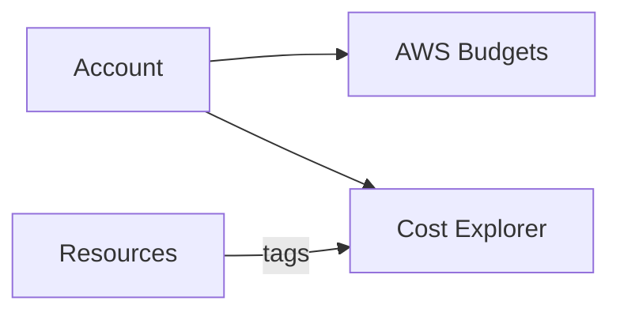

# Day 9 — Cost Monitoring & Governance (Free Tier)

> *Tutor voice:* In this lesson, I'll guide you step-by-step. Keep your AWS region set to **us-east-2 (Ohio)**. Use **nano** to edit files as we go.

## ✨ Concept (Textbook Style)
Set budgets and tags, and adopt a cleanup routine to avoid charges.

<!-- ALERT: new-concept -->

### ✈️ Analogy
**Operations budget** is like fuel allotment per route; we track & alert early.

## 🗺️ Architecture (Mermaid)


## 🧪 Hands-On Lab (Step by Step)

1) Create a monthly budget (CLI example, adjust email):
```bash
EMAIL="your@email"
cat > labs/budget.json <<'EOF'
{
  "BudgetName": "SkyBridge-FreeTier-Guard",
  "BudgetLimit": {"Amount": "1", "Unit": "USD"},
  "TimeUnit": "MONTHLY",
  "BudgetType": "COST",
  "CostFilters": {},
  "CostTypes": {"IncludeTax": true, "IncludeSubscription": true, "UseAmortized": false},
  "TimePeriod": {"Start": "2025-01-01T00:00:00Z"}
}
EOF
aws budgets create-budget --account-id $(aws sts get-caller-identity --query Account --output text)       --budget file://labs/budget.json       --notifications-with-subscribers 'NotificationType=ACTUAL,ComparisonOperator=GREATER_THAN,Threshold=1,ThresholdType=PERCENTAGE,NotificationState=ALARM'       --subscribers "SubscriptionType=EMAIL,Address=$EMAIL"
```

2) Tag resources consistently (sample shown Day 1).

3) Create a generic cleanup helper (see `scripts/cleanup.sh`) and run after each day.


## 🧹 Cleanup (Free Tier Safety)

- Validate no dangling resources remain using AWS Console (API Gateway, Lambda, DynamoDB, SNS/SQS).
- Consider lowering/deleting the budget if not needed.


## ✅ Outcomes
- Monthly budget alarms set
- Tagging discipline
- Cleanup routine established

---
**Notes**: Use `nano` to open and edit files. Save with **Ctrl+O**, **Enter**, exit with **Ctrl+X**.
