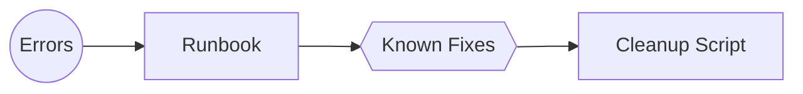

# Day 10 — Troubleshooting, Cleanup & Next Steps

> *Tutor voice:* In this lesson, I'll guide you step-by-step. Keep your AWS region set to **us-east-2 (Ohio)**. Use **nano** to edit files as we go.

## ✨ Concept (Textbook Style)
Collect common errors/fixes, finalize cleanup, and plan scalability & security hardening.

<!-- ALERT: new-concept -->

### ✈️ Analogy
**Turnaround operations** close a flight and prep for the next.

## 🗺️ Architecture (Mermaid)


## 🧪 Hands-On Lab (Step by Step)

### Common issues
<!-- ALERT: error/fix -->
- `AccessDeniedException` on Lambda → Verify IAM role and inline policies.
- 404 on API route → Ensure route created and $default stage auto-deploy is enabled.
- DynamoDB validation errors → Check key schema and payload types.

### Export binder-style PDF
```bash
bash scripts/generate-pdf.sh
```

### Plan next steps
- Consider adding WAF, Cognito/OAuth, and request validation.
- Migrate selected endpoints to REST API (usage plans & API keys) if partner rate plans needed.
- Add schema validation (OpenAPI) and CI/CD via GitHub Actions.


## 🧹 Cleanup (Free Tier Safety)

```bash
# Remove API
API_ID=$(cat labs/.api_id 2>/dev/null || true); [ -n "$API_ID" ] && aws apigatewayv2 delete-api --api-id $API_ID || true
# Remove Lambdas
for FN in skybridge-hello skybridge-get-flight skybridge-issue-ticket skybridge-checkin skybridge-baggage-track skybridge-booking skybridge-loyalty; do
  aws lambda delete-function --function-name $FN || true
done
# Remove tables
for T in skybridge-flights skybridge-orders skybridge-baggage skybridge-bookings skybridge-loyalty; do
  aws dynamodb delete-table --table-name $T || true
done
# Remove role
aws iam delete-role-policy --role-name skybridge-lambda-exec --policy-name ddb-read || true
aws iam delete-role-policy --role-name skybridge-lambda-exec --policy-name ddb-write || true
aws iam delete-role-policy --role-name skybridge-lambda-exec --policy-name baggage-write-sns || true
aws iam detach-role-policy --role-name skybridge-lambda-exec --policy-arn arn:aws:iam::aws:policy/service-role/AWSLambdaBasicExecutionRole || true
aws iam delete-role --role-name skybridge-lambda-exec || true
# Remove S3 bucket
LAB_BUCKET=$(cat labs/.bucket_name 2>/dev/null || true); [ -n "$LAB_BUCKET" ] && aws s3 rb s3://$LAB_BUCKET --force || true
```


## ✅ Outcomes
- Troubleshooting runbook started
- Binder-style PDF exported
- Account cleaned to free-tier baseline

---
**Notes**: Use `nano` to open and edit files. Save with **Ctrl+O**, **Enter**, exit with **Ctrl+X**.
